# 基于深度学习的工业轴承缺陷检测系统设计
**汇报单位**：南京理工大学 自动化学院
**汇报人**：[待填写]
**校训**：团结 献身 求是 创新
**精神**：齐心协力 自强不息

---

## 目录
1. 研究背景与国内外现状
2. 研究内容与方法
3. 系统的设计与构建
4. 已有进展与计划安排

---

## PART 01 研究背景与国内外现状
### 研究背景
1. **轴承核心地位**
轴承被称为“工业的关节”，在航空航天、轨道交通、智能制造等领域应用广泛，直接决定设备效率与寿命。
2. **传统方法局限**
人工检测效率低，微小瑕疵识别率不足60%；传统机器视觉与信号处理方法抗干扰弱，适配性差。
3. **缺陷危害与检测需求**
恶劣工况易导致轴承出现裂纹、磨损等缺陷，引发设备故障，亟需精准检测技术。
4. **工业核心痛点**
面临样本稀缺、实时性不足、复杂工况精度有限三大问题，现有模型难以兼顾需求。

> 建议插图位：典型缺陷样本拼图（正常/划痕/凹坑/腐蚀），用于帮助非本领域老师快速建立直观认知。

### 研究意义
1. **应用价值**
降本增效，安全保障，同时高精度检测可避免次品流入下游环节，提升产品质量。
2. **技术价值**
填补轴承智能检测的工程空白，为同类工业检测任务提供可复用方法。
3. **政策契合**
符合《中国制造2025》智能维护方向，助力制造业转型升级。

### 国内外研究现状
1. **早期检测工作**
- 传统边缘检测、阈值分割鲁棒性不足；Faster R-CNN、SSD、YOLO成为主流。
2. **近年研究进展**
- 超像素分割、注意力机制、多尺度融合可显著提升小缺陷检测效果。
3. **仍存在的问题**
- 在复杂光照、反光背景下，仍存在精度与实时性难以同时兼顾的问题。

### 本项目切入点
1. 以YOLO11为基础，优先解决“小缺陷可见性与可检测性”。
2. 通过“候选区域增强 + 轻量化”兼顾精度、速度和部署可行性。
3. 同步建设可演示系统，保证从算法到应用链路闭环。

---

## PART 02 研究内容与方法
### 系统需求分析
1. **功能性需求**
- 图像采集与预处理、缺陷检测与识别、结果统计与可视化、批量处理。
2. **工程需求**
- 兼顾准确性、实时性、可维护性与可扩展性。
3. **应用需求**
- 支持生产场景下的在线检测与离线质检两种模式。

### 总体研究内容
1. **把缺陷“看见”**
- 在复杂光照、反光背景下识别轴承表面缺陷（划痕/凹坑/腐蚀）。
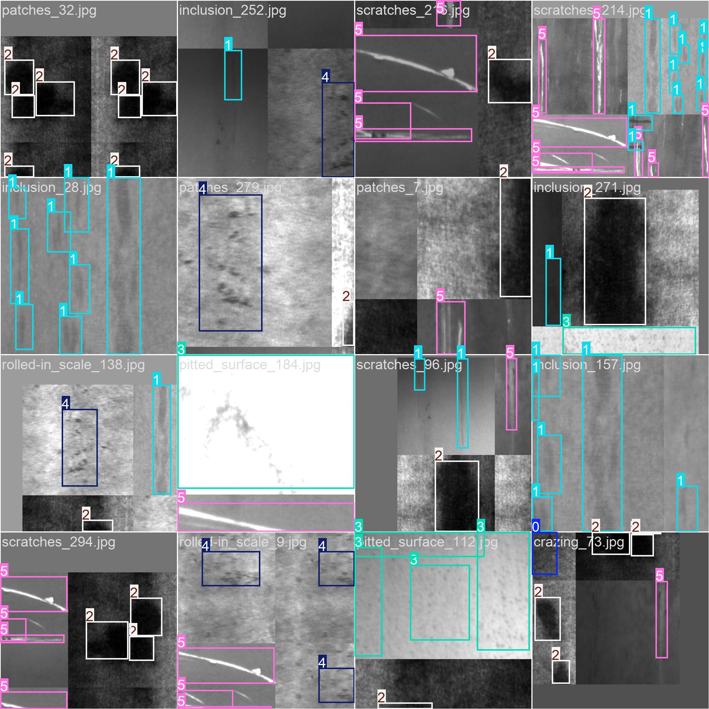
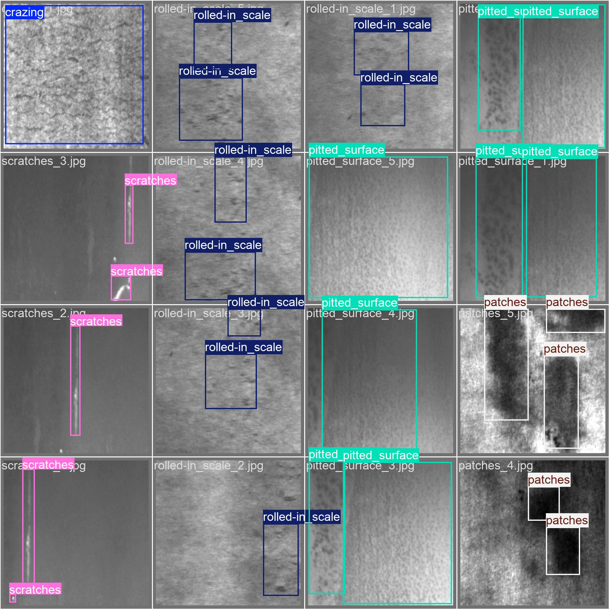
2. **把结果“做快”**
- 满足实时检测需求，支持在线预警与离线批量质检。
3. **把模型“做小”**
- 在保证精度前提下压缩模型，便于后续部署到边缘设备。

### 关键技术方法
1. **检测算法改进**
- 以YOLO11为基线，结合候选区域增强、注意力与损失优化提升小缺陷检测能力。
2. **鲁棒性增强**
- 面向复杂光照与背景干扰，优化数据增强与特征表达。
3. **系统工程化**
- 开发可演示、可复现、可扩展的检测系统（实时 + 批处理）。

### 评价指标
1. **精度指标**：mAP@0.5、mAP@0.5:0.95、Precision、Recall。
2. **速度指标**：FPS、端到端延迟。
3. **效率指标**：参数量、有效稀疏率、模型体积。
4. **工程指标**：流程可复现性、系统稳定性、可视化可用性。

---

## PART 03 系统的设计与构建
### 整体架构
1. **统一执行入口（可复现实验链路）**
- 统一CLI入口：doctor/check/prepare/train/val/predict/benchmark/report/export/distill/prune/clean
- 覆盖从数据检查、训练评估到蒸馏剪枝、报告生成的全流程
2. **当前已实现算法方案**
- 基线模型：YOLO11（640×640）
- 候选区增强：SLIC超像素 + GLCM纹理评分 + 熵阈值筛选（先找疑似缺陷区再增强）
- 引导方式：Spot-Guided在推理前强化疑似缺陷区域细节
- 轻量化：Teacher-Student蒸馏 + 通道剪枝 + 剪枝后微调
3. **系统实现（演示与应用）**
- PyQt5桌面端：实时检测、批处理检测、FPS反馈、结果可视化
- 输出产物：权重、ONNX、FPS基准CSV、剪枝统计JSON、自动实验报告
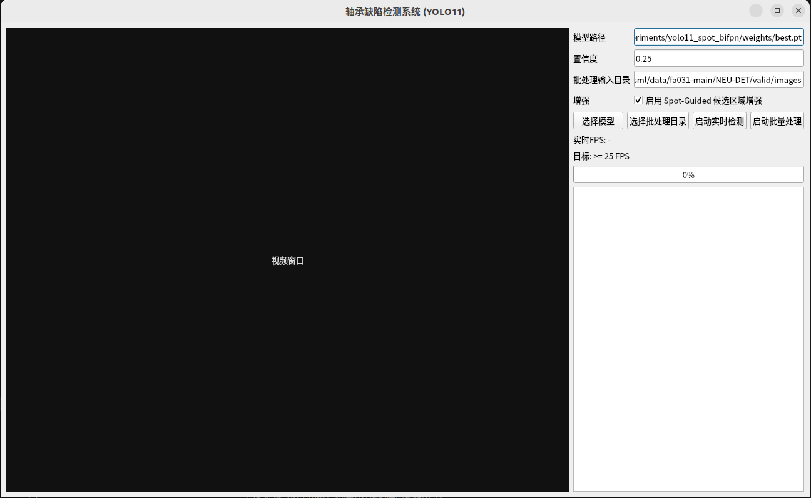

#### 对应代码证据：统一入口调度
为保证流程可复现，系统采用单一命令入口统一调度训练、验证、推理、压缩与报告。
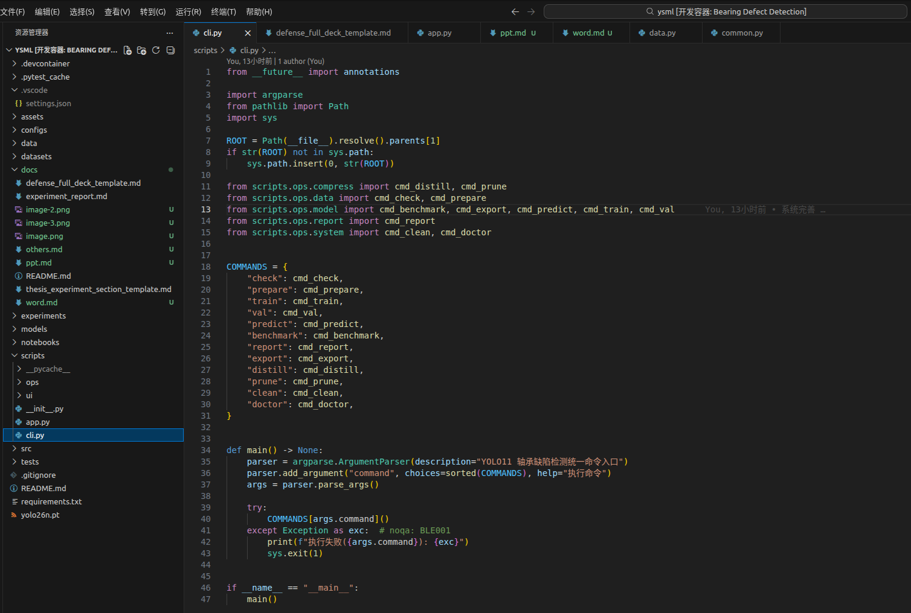

### 算法处理流程
1. 数据输入与预处理：读取图像并进行候选区域分析。
2. 缺陷检测推理：使用YOLO11完成缺陷定位与分类。
3. 候选区域增强：对疑似缺陷区域进行细节强化，提高小缺陷可识别性。
4. 结果输出：生成可视化结果、性能统计和实验证据文件。

#### 对应代码证据：候选区域增强核心实现
该模块先定位疑似缺陷区域，再进行细节增强，是提升微小缺陷可检测性的关键。
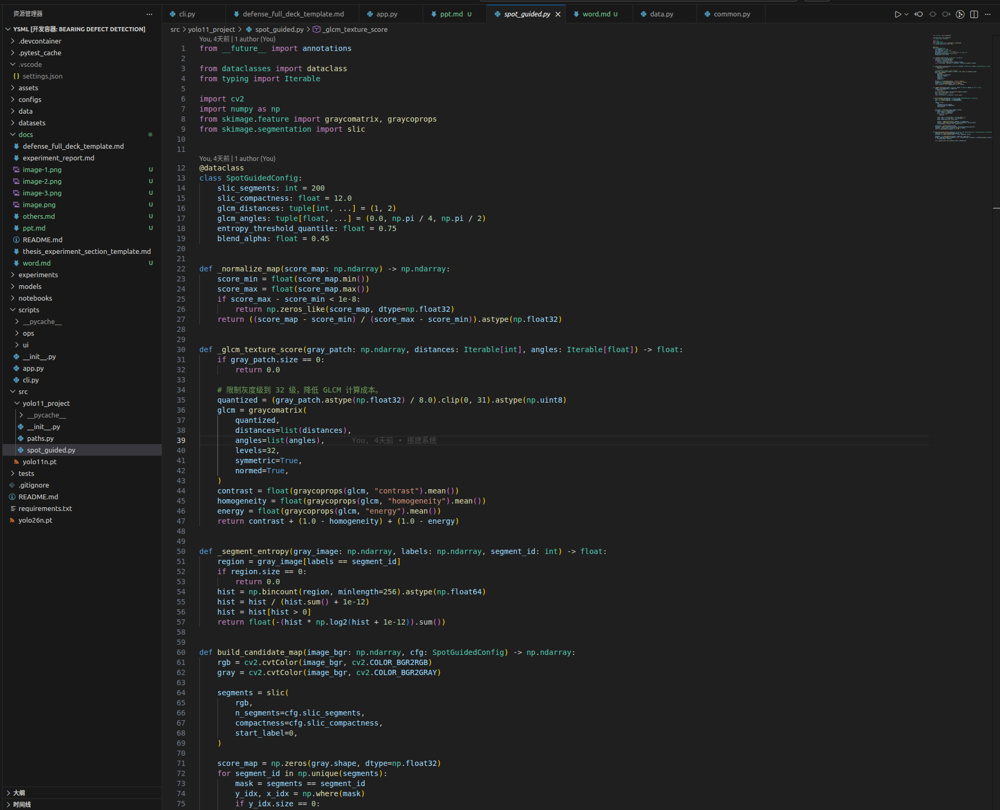

### 系统功能模块
1. **数据与配置层**
- 数据配置：支持数据集切换与激活配置读取
- 训练配置：基础训练参数 + 自适应损失参数
- 轻量化配置：蒸馏数据生成/复用、剪枝率与微调参数
2. **训练与评估层**
- 训练：100 epoch，自动适配类别不平衡（cls/fl_gamma）
- 验证：自动解析最新best.pt，输出精度摘要
- 基准：支持guided=false/true双模式测速并写入CSV
3. **工程鲁棒性设计**
- DataLoader异常自动降级workers，避免共享内存导致中断
- 自动选择最新实验权重，降低多次运行后的路径错误风险
- 标签去重、Comet可选禁用，保障训练过程稳定可控
4. **可视化系统能力**
- 摄像头实时检测与批处理目录检测
- 实时FPS显示与达标提示（目标25 FPS）
- 一键切换Spot-Guided增强开关，用于性能-精度权衡演示

#### 对应代码证据：训练与性能评估
训练与FPS基准在同一工程链路内完成，保证精度与速度评估口径一致。
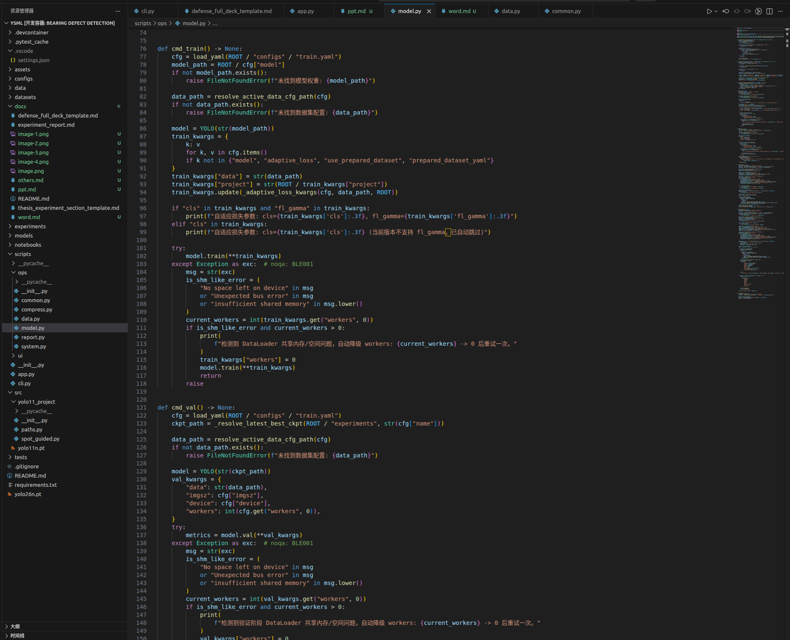

#### 对应代码证据：蒸馏与剪枝落地
轻量化模块用于验证“可部署性”，体现从算法性能到工程部署的过渡。
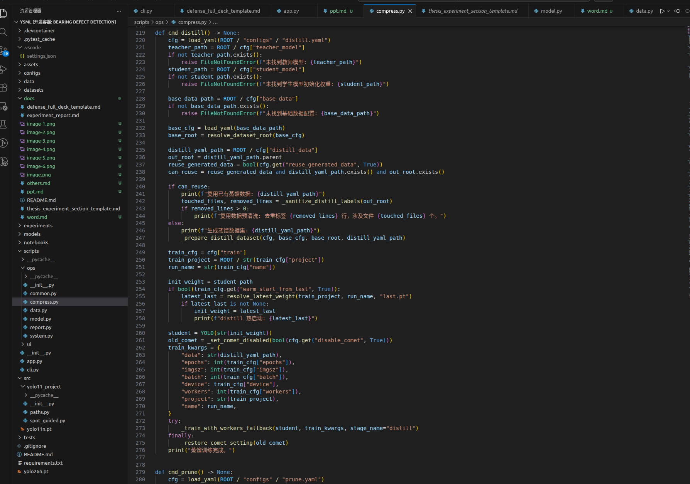
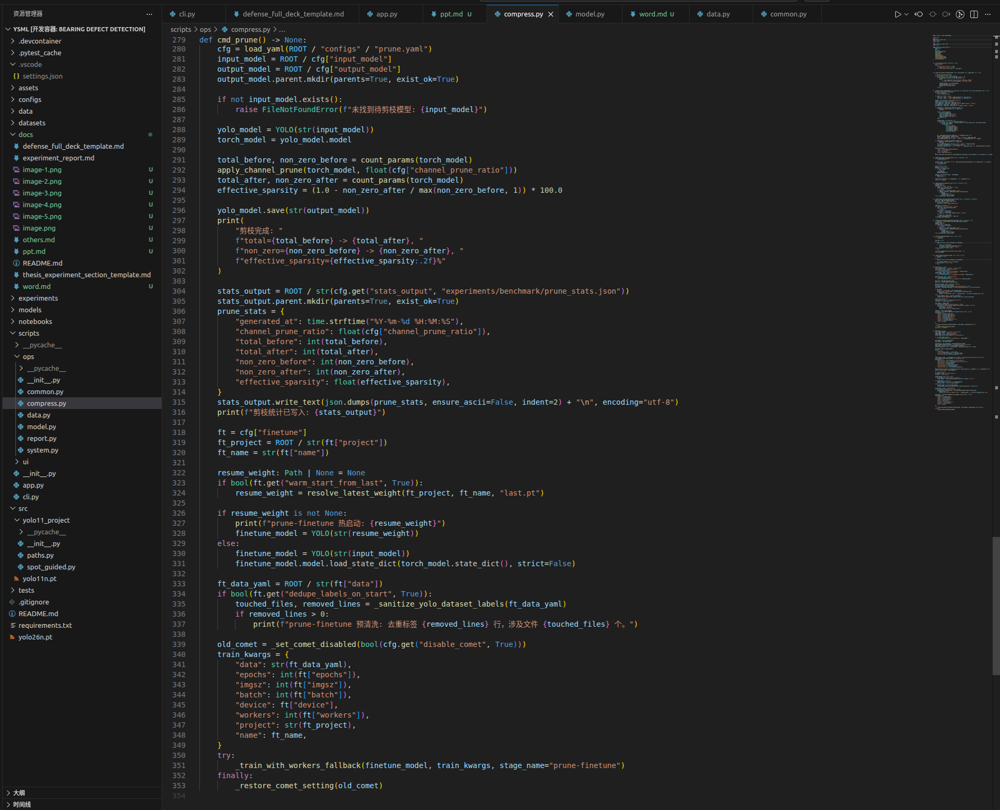

### 系统架构总结
1. 前端：PyQt5图形界面，支持实时与批处理交互。
2. 算法与服务：Python + PyTorch + OpenCV实现训练、推理和评估。
3. 结果管理：实验产物统一沉淀为权重、CSV、JSON和报告文档。

### 项目创新点
1. 候选区域增强：将超像素纹理信息用于缺陷区域引导，提升微小缺陷可见性。
2. 精度与部署并重：同一流程内完成检测优化与轻量化验证。
3. 工程闭环：从训练到报告自动化，减少“只做算法、不做落地”的断层。

---

## PART 04 已有进展与计划安排
### 已有进展
1. **工程化流程打通**
- 已形成“训练-验证-预测-基准-报告”闭环流程
- 已形成“蒸馏-剪枝-微调-证据输出”轻量化闭环流程
2. **核心功能落地**
- Spot-Guided候选区域增强模块已实现并接入CLI与GUI
- PyQt5检测系统可运行，支持实时与批处理双模式
- 自动报告可从CSV/JSON读取证据，减少人工填报偏差
3. **实验产物已生成**
- 基线训练权重、蒸馏权重、剪枝权重、微调权重均已产出
- ONNX模型已导出，FPS与剪枝统计文件已产出

### 阶段结果（来自已执行记录）
1. **检测精度**
- Best mAP@0.5 = 0.8469（epoch=100）
- Best mAP@0.5:0.95 = 0.5097（epoch=58）
- 最终Precision = 0.7484，Recall = 0.7866

#### 基线模型实验图位（yolo11_spot_bifpn）
> 可直接插入以下图片（按“总体曲线→混淆矩阵→预测样例”顺序展示）：

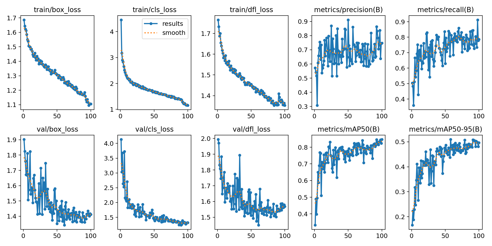
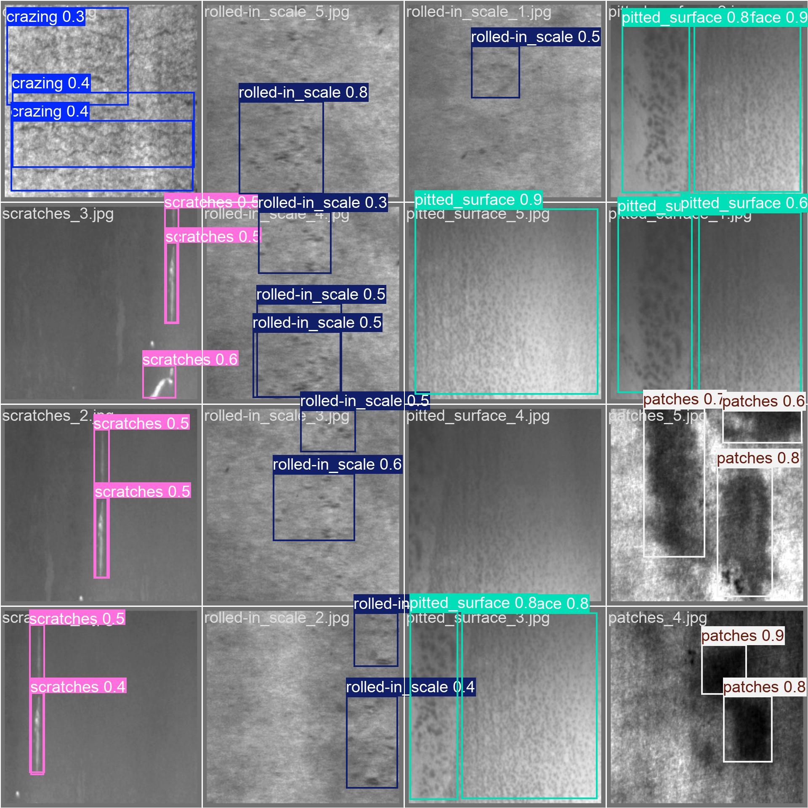

2. **速度表现（30张样本，640分辨率）**
- Spot-Guided关闭：40.1406 FPS
- Spot-Guided开启：9.9085 FPS
- 最高FPS超过25目标，但开启候选区增强后存在明显速度回落

3. **轻量化证据**
- 有效稀疏率：29.70%（目标29.50%，已达成）
- 当前文件体积对比：基线best.pt 5.23 MB，剪枝模型5.25 MB
- 说明：结构稀疏已达标，但序列化体积压缩尚不明显，后续需结合导出与部署优化

#### 对应代码证据：实验报告自动生成
该模块自动汇总CSV/JSON指标，降低人工统计误差，提升结果可信度。
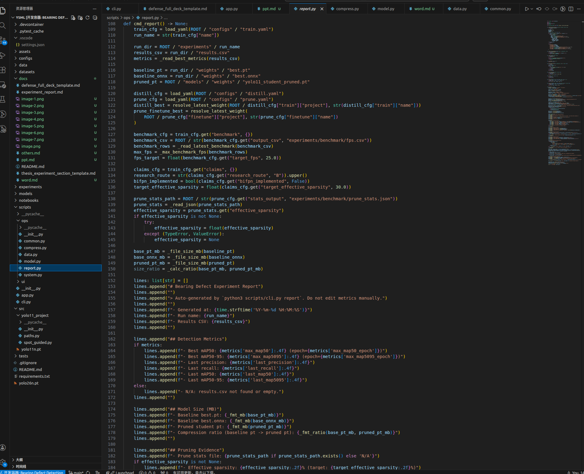

### 三个模型对比与结论
|模型|来源|best mAP@0.5|best mAP@0.5:0.95|last mAP@0.5|权重大小|
|---|---|---:|---:|---:|---:|
|基线模型|yolo11_spot_bifpn|0.84691|0.50973|0.84691|5.23 MB|
|蒸馏模型|yolo11_student_distill|**0.85611**|**0.52305**|0.79646|5.22 MB|
|剪枝微调模型|yolo11_student_pruned_finetune|0.82249|0.48482|0.77079|5.22 MB|

1. **区别是什么**
- 基线模型：标准训练得到的主模型，稳定性与可解释性较好。
- 蒸馏模型：通过教师-学生训练提升泛化能力，峰值精度最高。
- 剪枝微调模型：面向部署优化，当前更强调压缩路径验证。

2. **哪个更好（按场景）**
- 追求最高检测精度：优先蒸馏模型。
- 追求当前展示稳定性与一致性：优先基线模型。
- 追求后续端侧部署：以剪枝微调模型为基础继续量化/TensorRT优化。

#### 蒸馏模型实验图位（yolo11_student_distill）
> 可直接插入以下图片（建议与基线模型同位置对照展示）：

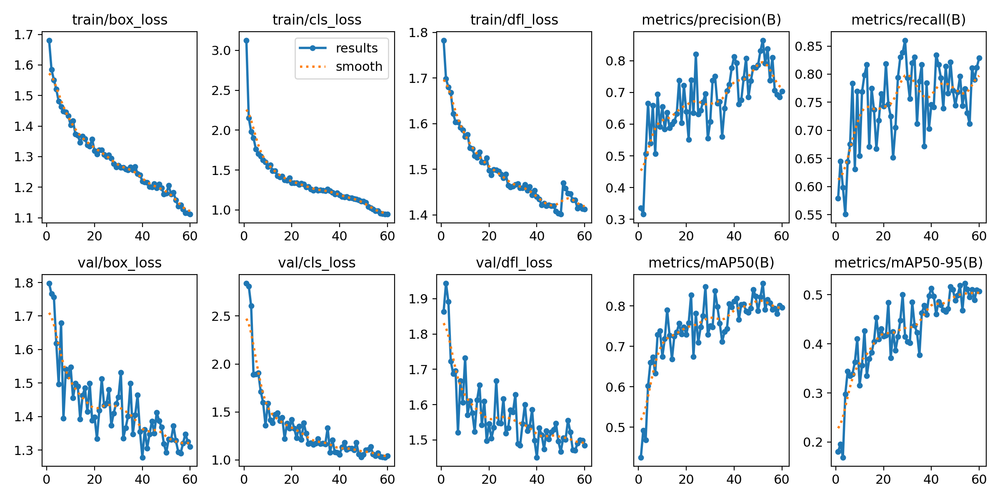
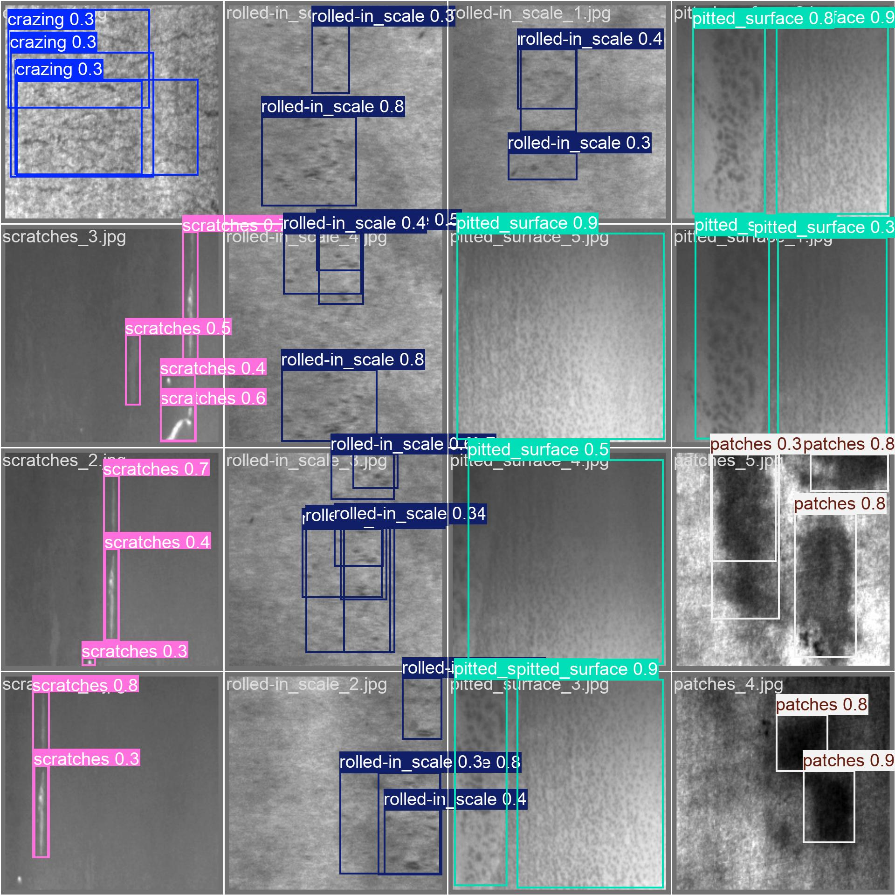

#### 剪枝微调模型实验图位（yolo11_student_pruned_finetune）
> 可直接插入以下图片（建议用于展示“轻量化后效果变化”）：

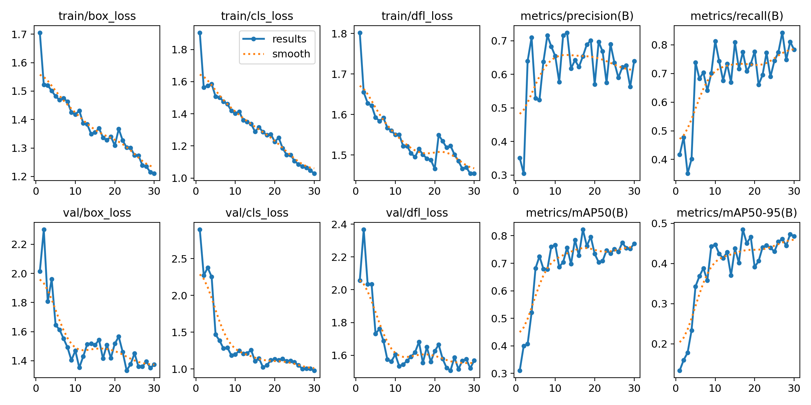
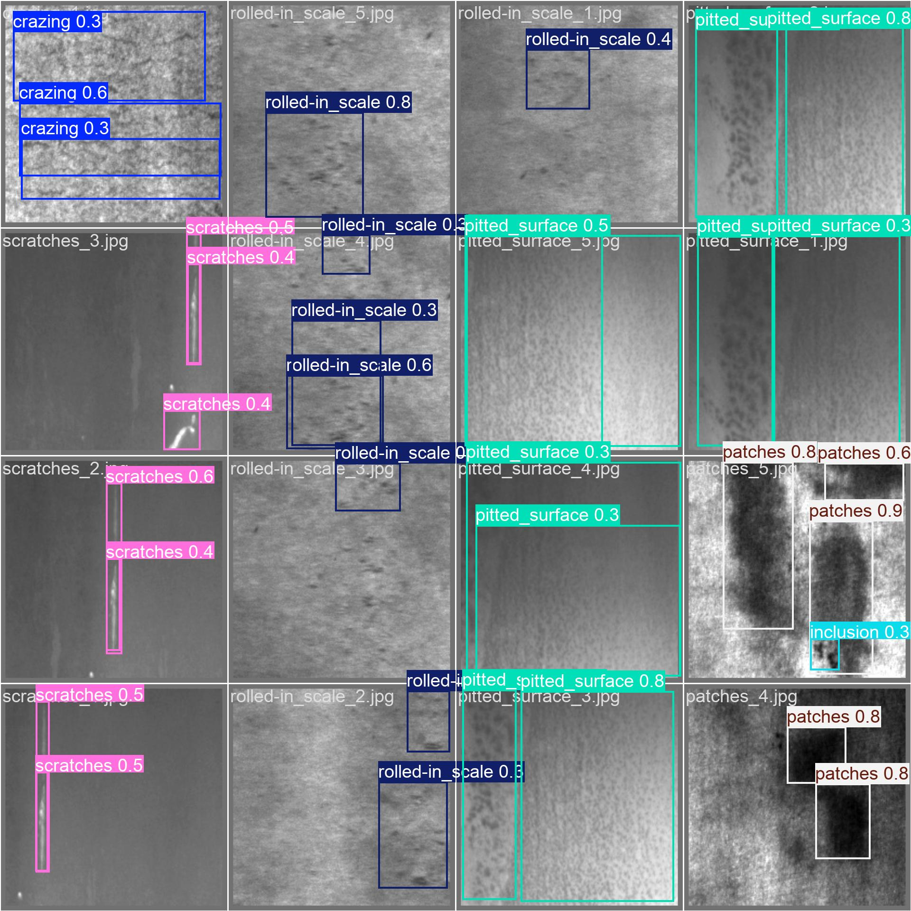

### 与目标对照
1. **已达到或超过**
- mAP@0.5目标0.82：当前0.8469，已达到
- 实时性目标25 FPS：在关闭Spot-Guided模式下已达到
2. **仍需攻关**
- 开启Spot-Guided时速度不足25 FPS
- “参数量压缩30%并体现部署收益”仍需通过更完整压缩链路验证
- BiFPN与更强鲁棒性模块仍在后续研究计划中（当前阶段以候选区域增强与轻量化为主）

### 问题与应对
1. **共享内存导致训练/验证中断**
- 已实现workers自动降级重试机制，训练稳定性显著提升
2. **多轮实验后权重路径混乱**
- 已实现自动解析最新实验权重机制，减少人工切换错误
3. **容器GUI中文显示与Qt插件冲突**
- 已增加字体加载与插件路径修复逻辑，界面可稳定运行

### 计划安排（2026.04-2027.09）
|阶段|时间|核心任务|量化目标|
|---|---|---|---|
|阶段1：稳态基线完善|2026.04-2026.06|补齐消融实验（Spot-Guided开关、损失参数、增强策略），完善实验记录规范|形成可复现实验手册；补全关键对比表|
|阶段2：小目标能力提升|2026.07-2026.10|推进BiFPN与注意力改进对比实验，优化复杂光照下召回率|小缺陷召回率提升，mAP@0.5稳定≥0.85|
|阶段3：轻量化与部署优化|2026.11-2027.02|蒸馏+剪枝+量化联动，评估ONNX/TensorRT部署收益|端到端延迟持续下降，部署模型体积明显下降|
|阶段4：系统集成与现场验证|2027.03-2027.06|完善系统交互、日志与报表导出，开展多工况稳定性测试|多场景稳定运行，形成现场测试记录|
|阶段5：成果凝练与结题|2027.07-2027.09|论文、专利/软著材料整理，完成结题答辩|提交论文与知识产权材料，完成验收|

### 团队成员分工
1. **负责人（模型与总体统筹）**
- 负责模型主线设计与实验组织
- 对应模块：训练评估、实验分析、技术路线迭代
2. **成员1（数据与算法增强）**
- 负责数据构建、标注质量与Spot-Guided改进
- 对应模块：数据检查/增强、候选区策略、鲁棒性增强
3. **成员2（系统与工程化）**
- 负责PyQt5系统功能完善与演示部署
- 对应模块：实时检测、批处理、界面交互、运行稳定性

### 下一阶段可交付成果
1. 一套完整消融实验表（含速度-精度权衡）
2. 一版轻量化部署对比报告（PT/ONNX/TensorRT）
3. 一版面向答辩的系统演示脚本与录屏材料
4. 论文初稿与专利技术交底书框架

### 结论页（建议作为最后一页）
1. 项目已从“概念方案”进入“可运行、可复现、可量化”的工程阶段。
2. 当前结果已达到核心阶段目标（mAP@0.5与实时性）。
3. 后续工作聚焦“增强模块提速 + 部署收益验证 + 现场稳定性测试”。